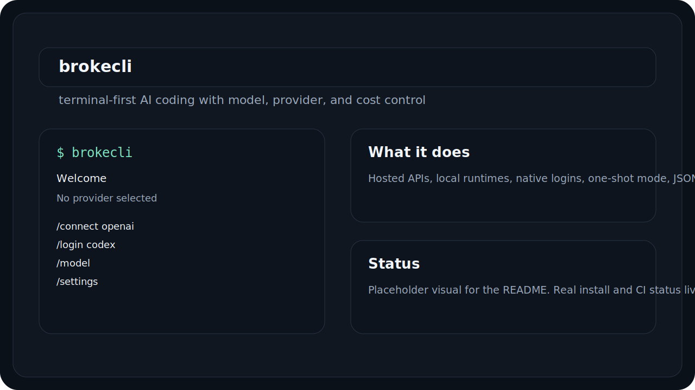
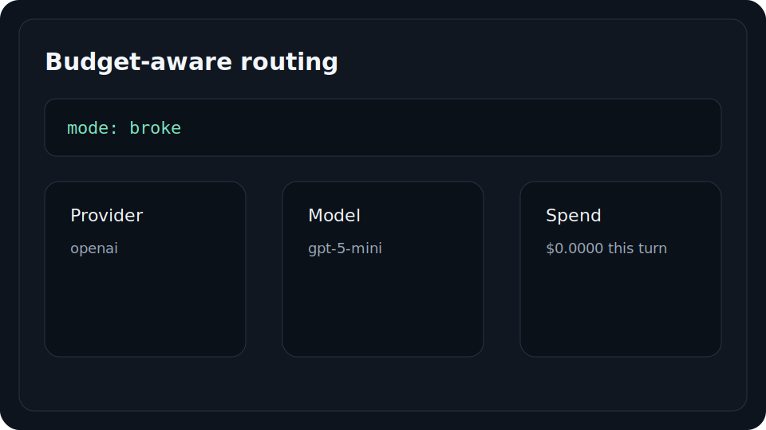
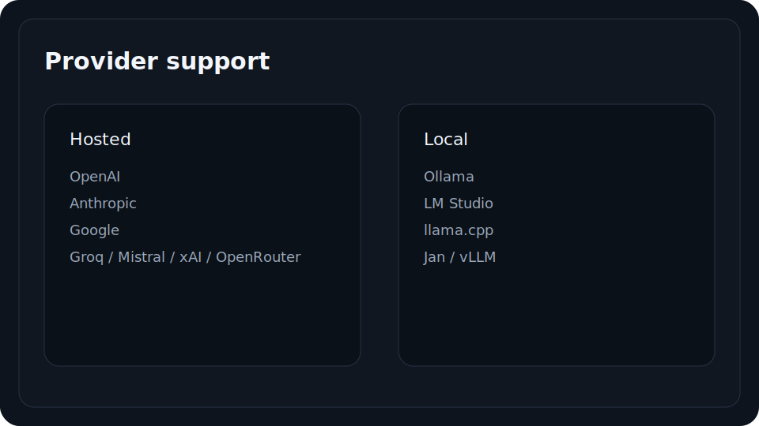
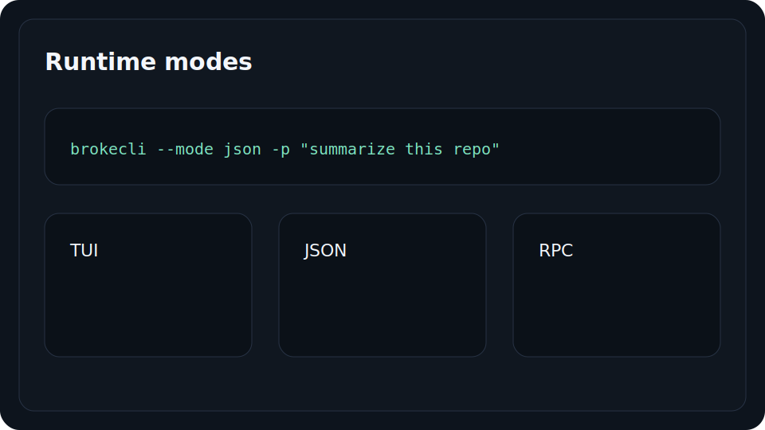
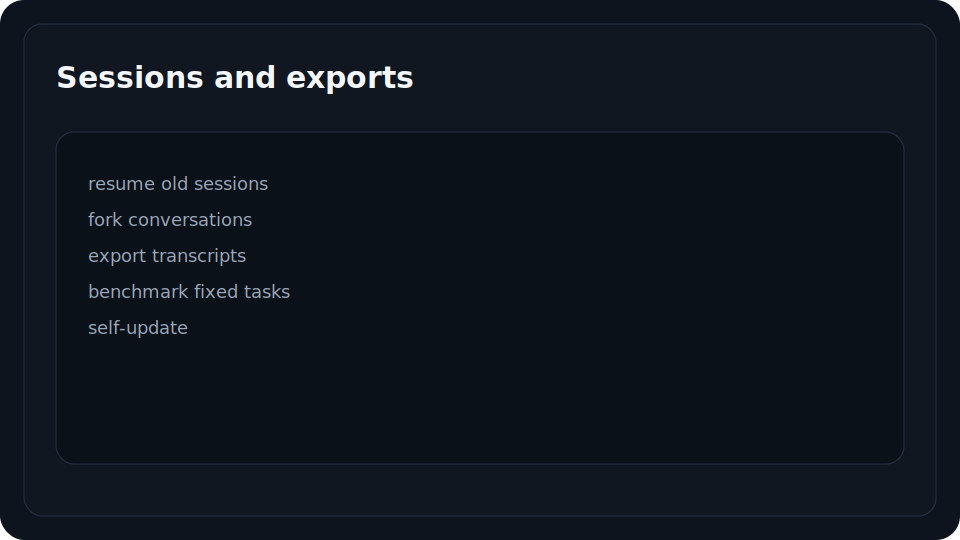

<h1 align="center">brokecli</h1>
<p align="center">
  
</p>
<p align="center">A terminal-first AI coding CLI with budget-aware model routing.</p>

<p align="center">
  <a href="https://github.com/jasperdevs/broke-cli/stargazers"></a>
  
</p>

<p align="center">
  
</p>

## Install

```bash
npm install -g @jasperdevs/brokecli
```

## Start

```bash
brokecli
```

Or run one-shot mode:

```bash
brokecli -p "summarize this repo"
```

Inside the app:

- `/connect <provider>` for API-key providers
- `/login <provider>` for supported native login flows
- `/model` to switch models
- `/settings` to change runtime behavior

## Features

<table>
<tr>
<td width="40%" valign="middle">
<h3>Caveman mode</h3>
Compresses assistant output hard when you want blunt, low-noise answers without changing code blocks or exact technical terms.
</td>
<td width="60%">

</td>
</tr>
<tr>
<td width="40%" valign="middle">
<h3>Sidebar + workspace state</h3>
The TUI keeps model, provider, workspace, and session state visible instead of hiding everything behind a blank prompt.
</td>
<td width="60%">

</td>
</tr>
<tr>
<td width="40%" valign="middle">
<h3>Slash commands + settings</h3>
Built-in commands like <code>/connect</code>, <code>/login</code>, <code>/model</code>, <code>/settings</code>, <code>/btw</code>, <code>/budget</code>, and more are part of the main workflow.
</td>
<td width="60%">

</td>
</tr>
<tr>
<td width="40%" valign="middle">
<h3>Provider routing + session tools</h3>
Mix hosted APIs, local runtimes, and supported native logins, then keep sessions, exports, self-update, and benchmark tasks in the same CLI.
</td>
<td width="60%">

</td>
</tr>
</table>

## License

MIT

## Star History

[](https://star-history.com/#jasperdevs/broke-cli&Date)
